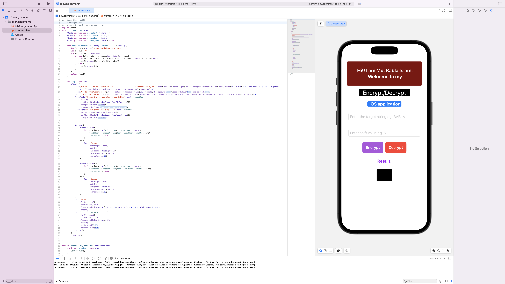
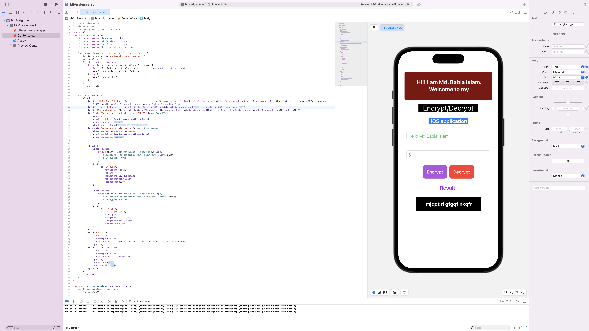

### Encrypt/Decrypt iOS Application

Welcome to the **Encrypt/Decrypt iOS Application**, a simple and intuitive app for performing Caesar Cipher encryption and decryption. This app is designed using **SwiftUI** and provides a user-friendly interface to secure your messages or decode encrypted texts with ease.

---

## Features

- **Text Encryption**: Encrypt any text using the Caesar Cipher algorithm.
- **Text Decryption**: Decode encrypted messages using the reverse of the Caesar Cipher algorithm.
- **Intuitive Input Fields**: Easily input text and specify the shift value.
- **Dynamic Result Display**: View encrypted or decrypted results instantly.

---

### Screenshot 1

### Screenshot 2

---

## How It Works

1. **Enter Text**: Type the text you want to encrypt or decrypt in the first input field.
2. **Specify Shift Value**: Enter a numerical shift value in the second input field (e.g., `5`).
3. **Choose Action**:
   - Tap **Encrypt** to encode the text.
   - Tap **Decrypt** to decode an encrypted text.
4. **View Results**: The result will appear below the buttons in the "Result" section.

---

## Code Overview

The app is built using **SwiftUI**, featuring:

1. **Caesar Cipher Logic**:
   - Implements a function `caesarCipher(text:shift:)` to perform the character-by-character transformation.
   - Supports both encryption and decryption by adjusting the shift value.
   
2. **State Management**:
   - Uses `@State` properties to manage user input and display results dynamically.

3. **User Interface**:
   - Text fields for user input.
   - Buttons styled for "Encrypt" and "Decrypt" actions.
   - Result section displaying the output in a styled label.

---

## Requirements

- iOS 15.0 or later
- Xcode 13.0 or later
- Swift 5

---

## Installation

1. Clone the repository or download the project.
2. Open the project in Xcode.
3. Build and run the app on the simulator or your iOS device.

---

## How to Customize

- **Change Text**: Modify the text in `Text()` views for a personalized message.
- **Enhance UI**: Update colors, fonts, or styles in the `body` to match your theme.
- **Add Features**: Extend the logic for advanced ciphers or multilingual support.

---

## Author

**Md. Babla Islam**  
*Created on: 17/11/2024*  

---

## License

This project is open-source and free to use for learning and development purposes.

--- 

Feel free to modify and enhance the app. Enjoy encrypting and decrypting! 🎉
